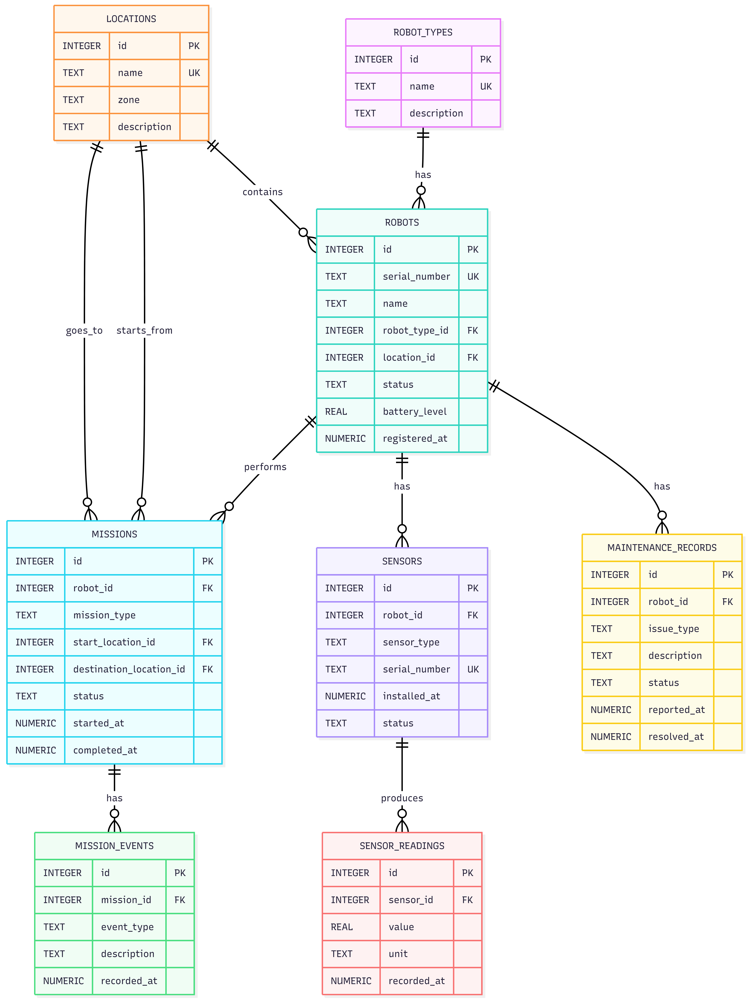

# RoboFleet Database System

## Overview

RoboFleet is a relational database system designed to manage a fleet of robots. It stores information about robots, locations, missions, sensors, and sensor readings using SQL and relational database principles.

This project demonstrates database design, data modeling, and SQL query implementation through a structured relational schema.

---

## Features

* Store and manage robot information
* Track robot locations
* Manage missions and assignments
* Store sensor details and readings
* Retrieve data using SQL queries
* Maintain data integrity using primary and foreign keys

---

## Technologies Used

* SQL
* SQLite
* Relational Database Design
* Entity Relationship Diagram (ERD)
* Git & GitHub

---

## Database Tables

The database consists of the following tables:

* **Robots** – Stores robot details.
* **Locations** – Stores location information.
* **Missions** – Stores mission details.
* **Sensors** – Stores sensors installed on robots.
* **Sensor_Readings** – Stores data collected from sensors.

---

## Relationships

* One location can have multiple robots.
* One robot can have multiple sensors.
* One robot can be assigned multiple missions.
* One sensor can have multiple sensor readings.
* Primary and foreign keys maintain relationships between tables.

---

## Entity Relationship Diagram (ERD)

---

## Learning Outcomes

Through this project, I learned how to:

* Design a relational database schema
* Create relationships between tables
* Use primary and foreign keys
* Write SQL queries for data retrieval
* Apply database normalization concepts
